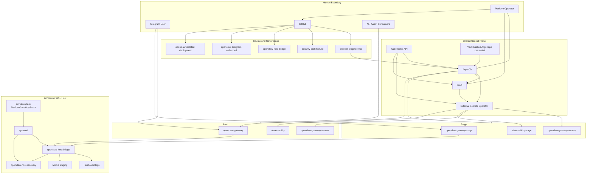

# Platform Overview

## Purpose

This document provides a single full-platform reference for architectural review and oversight detection.

## Diagram

## Main Review Themes

1. human identity and privilege boundaries
2. machine identity for GitOps and secret delivery
3. host-control trust exposure from user-facing channels
4. AI and agentic interaction paths that may cross trust boundaries
