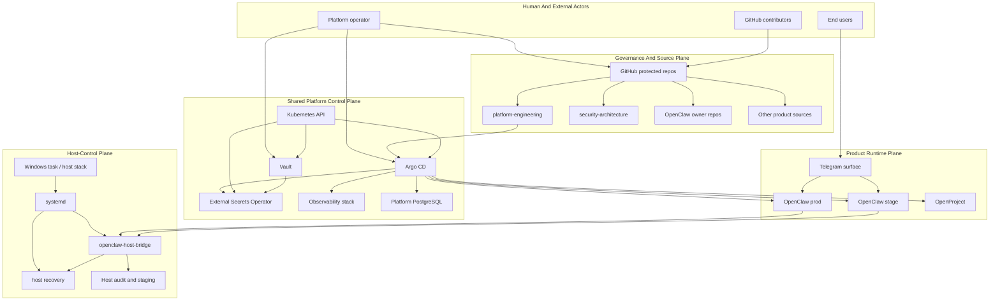

# Platform Overview

## Purpose

This document provides the top-level security architecture view for the
platform.

It explains how governance, shared control-plane components, product runtimes,
and the host-control boundary fit together.

## Diagram

## Architecture Layers

### Governance And Source Plane

- GitHub is the protected source boundary.
- `platform-engineering` expresses approved runtime intent.
- this repo defines the security review lens and durable security decisions
- product owner repos define candidate behavior but do not self-authorize
  production state

### Shared Platform Control Plane

- Argo CD reconciles Git-managed intent into cluster state
- Vault is the secret authority
- External Secrets bridges Vault policy into runtime namespaces
- Kubernetes underpins machine identity and controller trust
- observability and shared data services support platform operations and require
  their own security posture

### Product Runtime Plane

- OpenClaw and OpenProject are product surfaces with different threat profiles
- Telegram is a user-facing and model-adjacent surface for OpenClaw
- stage mirrors high-trust OpenClaw paths and should be treated as a real
  pre-production trust boundary, not a toy environment

### Host-Control Plane

- the host bridge and recovery services form the most sensitive local execution
  boundary
- product logic may request host-facing operations, but host policy and audit
  must remain outside the product runtime

## Main Review Themes

1. human identity and privilege boundaries
2. machine identity for GitOps and secret delivery
3. cross-product control-plane trust
4. host-control exposure from user-facing and model-assisted paths
5. AI and agentic interaction paths that may cross trust boundaries

## Related Views

- [`component-inventory.md`](component-inventory.md)
- [`trust-boundaries.md`](trust-boundaries.md)
- [`../domains/host-control.md`](../domains/host-control.md)
- [`../domains/ai-and-agentic.md`](../domains/ai-and-agentic.md)
- [`../products/openclaw/README.md`](../products/openclaw/README.md)
