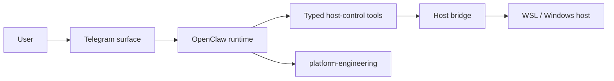

# OpenClaw Data Flow And Boundaries

## Purpose

This document explains the security-relevant data flow for OpenClaw.

## Diagram

## Primary Boundaries

- channel boundary:
  - user-facing and untrusted
- runtime boundary:
  - orchestration, session state, and typed tool requests
- host-enforcement boundary:
  - bridge policy, audit, and staging
- platform control boundary:
  - build approval, digest recording, and deployment reconciliation

## Why The Components Are Separate

### Telegram surface

Telegram behavior is channel-specific and should not be absorbed into host
enforcement or platform rollout logic.

Read-only operator inventory may be rendered through the Telegram surface, but
the source of truth for platform endpoints, health checks, and governance notes
should stay in the platform control boundary instead of being hardcoded in the
channel layer.

### Runtime

The runtime orchestrates sessions, routing, tools, and agent execution, but it
must not become the host trust anchor.

### Typed host-control tools

The product uses explicit tools so privileged intent remains reviewable and can
be gated outside the model.

### Host bridge

The bridge remains the enforcement point for allowed roots, policy, audit, and
staging.

### Platform governance

Build, digest approval, and deployment reconciliation remain outside the
product's own runtime path.

## Key Design Rule

The runtime may request host-facing actions, but the bridge must remain the
enforcement point for:

- allowed roots
- permission tiers
- audit
- export staging
- recovery wiring

## Related Views

- [`security-overview.md`](security-overview.md)
- [`../../domains/host-control.md`](../../domains/host-control.md)
- [`../../components/openclaw-host-bridge/README.md`](../../components/openclaw-host-bridge/README.md)
